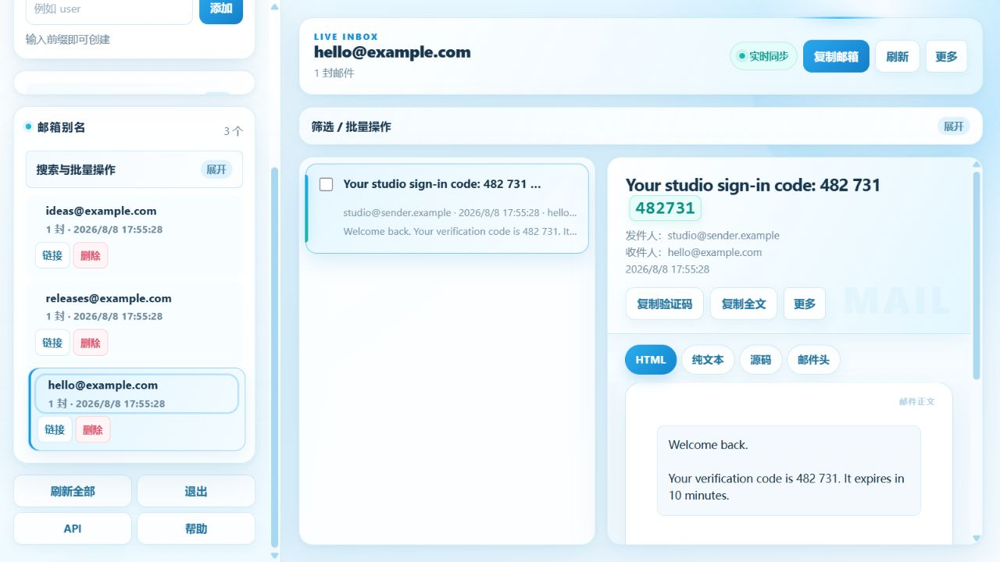

<p align="center">
  
</p>

<h1 align="center">Ferret Mail</h1>

<p align="center">
  给自己的域名，留一间只负责接住消息的房间。<br>
  <em>Give your domain a quiet room built simply to receive.</em>
</p>

<p align="center">
  <a href="../../actions/workflows/ci.yml"></a>
  
  
  
  <a href="LICENSE"></a>
</p>

<p align="center">
  <a href="#中文">中文</a> · <a href="#english">English</a> ·
  <a href="部署教程.md">部署</a> · <a href="技术文档.md">技术文档</a> ·
  <a href="../../issues">反馈</a>
</p>

## 中文

Ferret Mail 是一个可自托管的“只收不发”域名邮箱：它在一份 Python 文件里提供 SMTP 收件、响应式管理后台、HTTP API、SQLite 存储、验证码提取和安全备份。没有云账号，也没有隐藏的第三方服务。



### 它能做什么

- 接收多个主域名、子域名与自动别名的邮件；
- 在网页里检索邮件、阅读正文、复制验证码、查看链接和下载附件；
- 为不同域名签发独立管理 Token，也可创建单别名接码链接；
- 提供长轮询 API、Webhook、DNS 检查、容量配额、限流与操作日志；
- 自动备份 SQLite 数据，并对 HTTP、SMTP、磁盘和备份状态做健康检查。

### 适合与不适合

它适合个人域名收件、测试环境、验证码归档与小型内部工具；它不提供发信、IMAP、日历或完整邮件客户端能力。公开部署需要固定公网 IP、可用的 TCP 25 端口、正确的 MX/A 记录与 HTTPS 反向代理。

### 快速开始

```bash
cp .env.example .env
# 编辑 .env，至少设置长随机 PANEL_TOKEN、MAIL_DOMAIN 与 PUBLIC_IP
set -a && . ./.env && set +a
python3 ferret_mail_service.py
```

生产环境请按 [部署教程](部署教程.md) 使用非 root 用户、systemd、HTTPS 与受限文件权限；完整变量见 [.env.example](.env.example)。

## English

Ferret Mail is a self-hosted, receive-only domain mail service. One Python file provides SMTP ingestion, a responsive admin UI, an HTTP API, SQLite storage, verification-code extraction, and guarded backups—without a cloud account or hidden third-party service.

### Highlights

- Receive mail for multiple root domains, subdomains, and automatically created aliases.
- Search and read messages, copy codes, inspect links, and download attachments in the web UI.
- Issue per-domain admin tokens or narrowly scoped public inbox links.
- Use long-polling APIs, webhooks, DNS checks, quotas, rate limits, and operation logs.
- Back up SQLite data and monitor HTTP, SMTP, storage, and backup health.

Ferret Mail is designed for personal domains, test environments, code inboxes, and small internal tools. It is not an outbound mail server, IMAP service, calendar, or full mail client. Public deployment requires a reachable TCP 25 port, valid MX/A records, and HTTPS in front of the admin UI.

See the [deployment guide](部署教程.md), [technical reference](技术文档.md), and [configuration template](.env.example).

## Privacy & security

The repository contains no deployment database, message, credential, real domain, server address, or production log. Never commit `.env`, SQLite files, backups, downloaded attachments, or screenshots from a live inbox. Please report vulnerabilities through [SECURITY.md](SECURITY.md).

## License

Code is available under the [MIT License](LICENSE).
